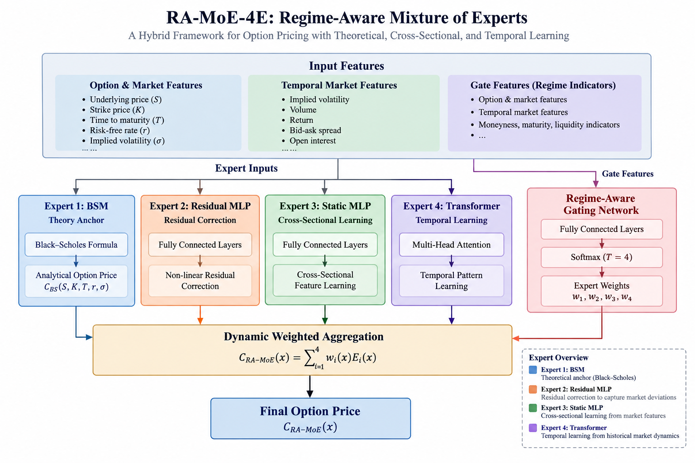
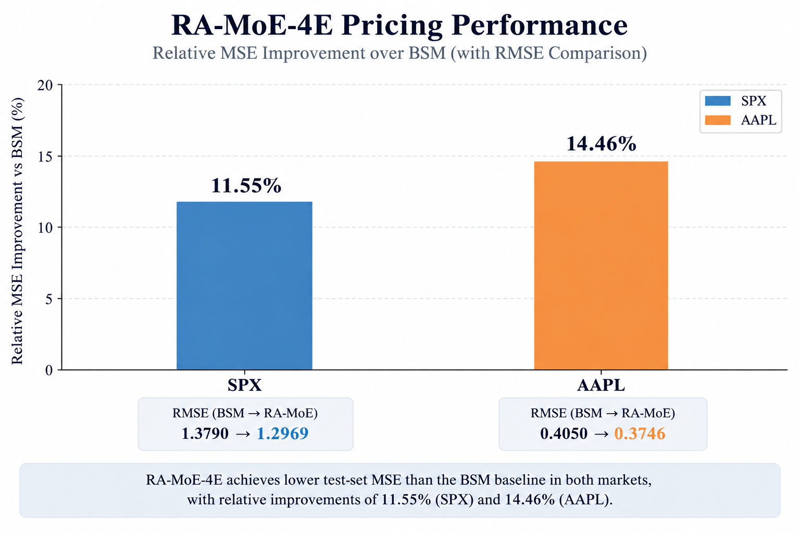
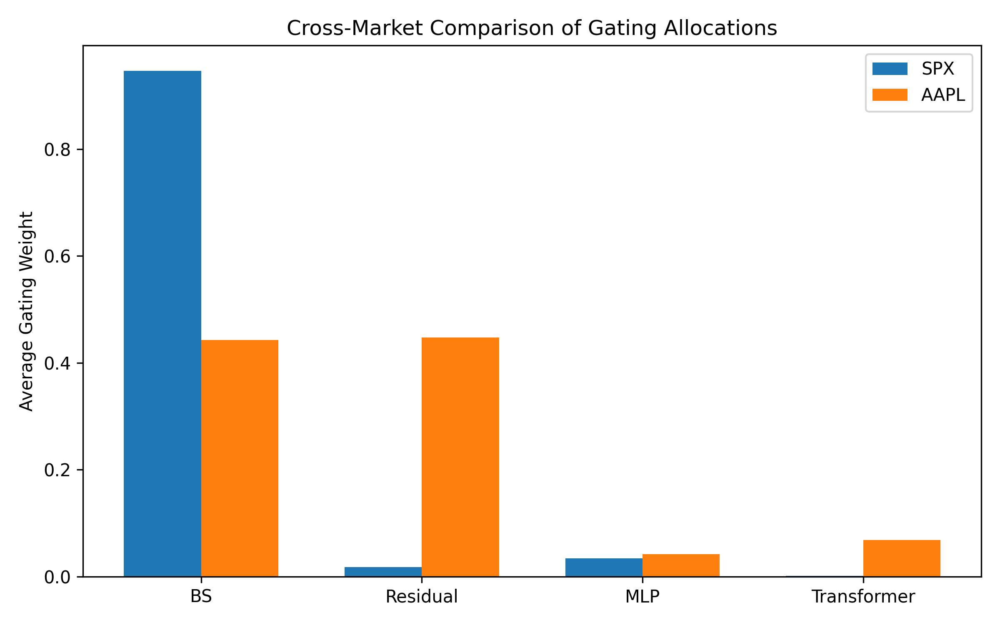

# RA-MoE-4E

### Regime-Aware Mixture-of-Experts for Robust Option Pricing

RA-MoE-4E is a theory-guided Mixture-of-Experts framework that dynamically combines a Black–Scholes–Merton (BSM) theoretical anchor with specialized neural experts for option pricing across heterogeneous market conditions.

The project investigates a broader machine-learning question:

> **Can theory-driven and data-driven experts specialize and cooperate through state-dependent dynamic routing?**

The framework was developed as an individual research project and evaluated on S&P 500 (SPX) index options and Apple (AAPL) equity options.

---

## Overview

Classical option-pricing models provide strong theoretical structure and economic interpretability, but their assumptions may become restrictive under heterogeneous or changing market conditions.

Purely data-driven models offer greater flexibility but may sacrifice structural interpretability and robustness.

RA-MoE-4E explores a hybrid approach by combining four heterogeneous experts through a regime-aware gating network:

1. **BSM Expert** — provides a theory-driven pricing anchor.
2. **Residual MLP Expert** — learns systematic corrections relative to the BSM baseline.
3. **Static MLP Expert** — captures nonlinear cross-sectional pricing relationships.
4. **Transformer Expert** — models sequential patterns from historical option-level features.

A gating network dynamically assigns state-dependent weights to the four experts, allowing the mixture to adapt its internal pricing mechanism across observations.

---

## Architecture

RA-MoE-4E combines four heterogeneous experts through a **regime-aware gating network**.

For each option observation, the final prediction is a dynamically weighted combination of the four expert outputs:

$$
P_{\mathrm{hybrid}}
=
\sum_{i=1}^{4} w_i E_i(X_i)
$$

where

$$
w_i \geq 0,
\qquad
\sum_{i=1}^{4} w_i = 1.
$$

The weights are generated through a temperature-controlled softmax gating network using option and market-state features.

### Four Specialized Experts

| Expert | Role | Main Idea |
|---|---|---|
| **BSM** | Theoretical anchor | Provides a classical theory-based pricing benchmark |
| **Residual MLP** | Theory correction | Learns systematic corrections relative to the BSM baseline |
| **Static MLP** | Cross-sectional learning | Captures nonlinear relationships across static option and market features |
| **Transformer** | Sequential learning | Processes fixed-length histories of option-level temporal features |

<p align="center">
  
</p>

<p align="center">
  <em>RA-MoE-4E architecture: four heterogeneous experts are dynamically combined through a regime-aware gating network.</em>
</p>

---

## Research Questions

**RQ1.** Can dynamic expert routing improve option-pricing performance across heterogeneous observations and market structures?

**RQ2.** Can theory-driven and neural experts provide complementary inductive biases?

**RQ3.** Do different experts exhibit distinct allocation patterns across different markets and option characteristics?

**RQ4.** Can a theory-guided mixture improve predictive performance while retaining interpretable connections to classical option-pricing structure?

---

## Model Inputs

The implementation uses separate feature representations for different components of the mixture.

### Static MLP

The static expert receives features including:

- spot price and strike price;
- moneyness and time to maturity;
- implied volatility;
- short- and medium-window realized-volatility statistics;
- implied-volatility dispersion;
- bid–ask spread;
- trading volume;
- open interest.

### Residual Expert

The residual-correction network receives the standardized static representation together with residual-specific features including option Greeks, moneyness, spread, and the available skew representation.

During residual-expert pretraining, the learning target is:

$$
P_{\mathrm{market}} - P_{\mathrm{BSM}}.
$$

### Transformer Expert

The supplied final implementation constructs fixed-length sequences from:

- implied volatility;
- trading volume;
- underlying return;
- bid–ask spread;
- open interest.

The default sequence length is **10 observations**.

### Gating Network

The gating network combines the standardized static representation with additional state features including:

- implied volatility;
- moneyness;
- time to maturity;
- realized-volatility measures;
- implied-volatility deviation;
- bid–ask spread;
- change in open interest.

The resulting routing distribution determines the contribution of each expert to the final prediction.

---

## Data

The empirical study uses two option markets with substantially different characteristics:

- **SPX index options:** approximately 3.94 million observations after filtering.
- **AAPL equity options:** approximately 0.85 million observations after filtering.

Raw option data were obtained from **OptionMetrics IvyDB U.S.**

> **Data availability:** Raw OptionMetrics observations and large derived datasets are not distributed in this repository because of licensing restrictions. The repository exposes the model, preprocessing, training, and evaluation logic without redistributing proprietary observations.

See [`data/README.md`](data/README.md) for the expected input schema and preprocessing requirements.

---

## Training Strategy

Training follows the procedure implemented in the supplied final experimental codebase.

### Stage 1 — Residual-Expert Pretraining

The residual MLP is first trained for **5 epochs** against:

$$
y_{\mathrm{residual}}
=
P_{\mathrm{market}}
-
P_{\mathrm{BSM}}.
$$

### Stage 2 — Expert Training with the Gate Frozen

The gating network is frozen while the trainable experts are optimized through the hybrid training objective for **10 epochs**.

### Stage 3 — Joint Fine-Tuning

The gate is unfrozen and the complete mixture is jointly optimized for up to **20 epochs**.

Validation-based early stopping is used with a patience of **5 epochs**, after which the best validation model state is restored.

The supplied implementation uses:

- pretraining learning rate: `5e-5`;
- joint fine-tuning learning rate: `1e-4`;
- batch size: `512`;
- gating temperature: `4.0`;
- random seed: `42`.

The supplied SPX implementation uses a residual scaling factor of `5.0`. Market-specific experimental configurations may differ.

---

## Evaluation

The core evaluation compares RA-MoE-4E against the BSM baseline using:

- **Mean Squared Error (MSE)**
- **Mean Absolute Error (MAE)**
- **Root Mean Squared Error (RMSE)**
- **Relative Pricing Error (RPE)**

The original evaluation also uses a **Diebold–Mariano test** to compare squared pricing-error losses between RA-MoE-4E and the BSM baseline.

Beyond aggregate pricing accuracy, the project examines:

- routing-weight distributions;
- pricing-error distributions;
- cross-market expert allocation;
- post-hoc expert contribution sensitivity;
- financial-consistency diagnostics on a filtered SPX call-option subset.

Core metrics are separated from market-specific and post-hoc analyses in the public repository.

---

## Main Results

The canonical cross-market evaluation reports lower MSE, MAE, and RMSE for RA-MoE-4E than for the BSM baseline in both SPX and AAPL.

| Market | RA-MoE-4E MSE | BSM MSE | RA-MoE-4E RMSE | BSM RMSE | Relative MSE Improvement |
|---|---:|---:|---:|---:|---:|
| **SPX** | 1.6819 | 1.9016 | 1.2969 | 1.3790 | **11.55%** |
| **AAPL** | 0.1403 | 0.1640 | 0.3746 | 0.4050 | **14.46%** |

Relative improvement is defined as:

$$
\mathrm{Improvement}
=
\frac{
\mathrm{MSE}_{\mathrm{BSM}}
-
\mathrm{MSE}_{\mathrm{RA\text{-}MoE}}
}{
\mathrm{MSE}_{\mathrm{BSM}}
}
\times 100.
$$

<p align="center">
  
</p>

<p align="center">
  <em>Relative MSE improvement over the BSM baseline. RA-MoE-4E reduces test-set MSE by 11.55% on SPX and 14.46% on AAPL; the corresponding RMSE changes are shown in the figure.</em>
</p>

---

## Cross-Market Expert Specialization

The learned routing distributions differ substantially between SPX and AAPL.

| Market | BSM | Residual MLP | Static MLP | Transformer |
|---|---:|---:|---:|---:|
| **SPX** | 94.11% | 2.12% | 3.60% | 0.17% |
| **AAPL** | 44.27% | 44.76% | 4.16% | 6.82% |

<p align="center">
  
</p>

<p align="center">
  <em>Average gating allocations across SPX and AAPL. SPX routing is strongly concentrated on the BSM expert, whereas AAPL distributes substantial weight between the BSM and residual-correction experts.</em>
</p>

The contrast suggests that the learned mixture does not rely on a single fixed expert allocation across markets. Instead, the gating network exhibits substantially different routing patterns in the two experimental settings.

These allocations are interpreted as **descriptive evidence of learned expert specialization**, rather than as causal evidence about the underlying market structure.

---

## Expert Contribution Analysis

The original project includes a post-hoc sensitivity analysis of expert contributions.

For the **Static MLP** and **Transformer**, the selected expert output is removed and the remaining routing weights are renormalized.

For the **Residual MLP**, the original analysis attenuates the learned residual correction rather than fully removing the expert.

The public analysis therefore describes these experiments as **expert contribution sensitivity**, rather than as retrained architectural ablation.

The original outputs indicate that prediction sensitivity differs substantially across experts and markets. These results are interpreted as post-hoc diagnostics of the trained mixture rather than estimates from independently retrained reduced architectures.

---

## Financial Consistency Diagnostics

The original SPX analysis includes post-hoc diagnostics designed to examine economically meaningful option-pricing behaviour.

The analysis is performed on a filtered call-option subset, restricting observations to approximately at-the-money contracts (`0.95 < moneyness < 1.05`), maturities longer than seven days, positive trading volume where available, and non-negligible market prices.

The diagnostics include:

- **Strike monotonicity** — whether predicted call prices increase as strike increases within matched date and maturity groups;
- **Discrete strike convexity** — violations of non-negative second price differences across neighboring strikes;
- **Calendar-spread consistency** — cases where a longer-maturity call is predicted to be cheaper than a shorter-maturity call at the same date and strike;
- **Delta-hedging residuals** — hedging-error RMSE and PnL variance using the supplied option delta as a common hedge ratio.

The retained aggregate outputs are:

| Diagnostic | BSM | RA-MoE-4E |
|---|---:|---:|
| Strike monotonicity violation | 3.13% | 3.18% |
| Discrete convexity violation | 33.16% | 36.43% |
| Calendar-spread violation | 6.10% | 5.90% |
| Hedging RMSE | 23.48 | 23.93 |

RA-MoE-4E and BSM therefore exhibit similar strike-monotonicity violation rates. RA-MoE-4E shows a slightly lower calendar-spread violation rate, while BSM performs slightly better on the retained discrete-convexity and hedging diagnostics.

These tests are empirical post-hoc diagnostics rather than theoretical guarantees that RA-MoE-4E satisfies no-arbitrage conditions.

---

## Repository Structure

```text
RA-MoE-4E/
│
├── README.md
├── requirements.txt
├── .gitignore
│
├── figures/
│   ├── architecture.png
│   ├── pricing_performance.png
│   └── gating_weights_across_markets.png
│
├── data/
│   └── README.md
│
├── results/
│   ├── README.md
│   ├── pricing_summary.csv
│   └── financial_consistency/
│       ├── no_arbitrage.csv
│       ├── calendar.csv
│       └── hedging.csv
│
├── scripts/
│   └── train.py
│
├── analysis/
│   ├── cross_market_gating.py
│   ├── expert_contribution.py
│   └── financial_consistency.py
│
└── src/
    └── ra_moe/
        ├── models/
        ├── data/
        ├── training/
        └── evaluation/
```

The `src/ra_moe/` package contains the modular model, preprocessing, training, and core evaluation implementation. Market-specific and post-hoc research analyses are kept separately under `analysis/`.

---

## Running the Training Pipeline

Install the public dependencies:

```bash
pip install -r requirements.txt
```

Then run:

```bash
python scripts/train.py --data /path/to/cleaned_option_data.csv
```

For a smaller experimental run:

```bash
python scripts/train.py \
    --data /path/to/cleaned_option_data.csv \
    --sample-fraction 0.1
```

Because the underlying OptionMetrics data are proprietary, the original datasets are not included in this repository.

---

## Reproducibility Notes

This repository is a modular refactor of the original experimental RA-MoE-4E codebase.

The refactoring aims to improve readability and organization while preserving the implemented model and training behaviour.

Where the written methodology and supplied final implementation differ, the repository prioritizes the **implemented experimental behaviour** rather than silently modifying the code to match the written description.

Material differences identified during refactoring include aspects of:

- Transformer positional encoding;
- temporal feature definitions;
- residual-expert feature specification;
- selected hyperparameters;
- training-stage descriptions;
- routing regularization behaviour.

Historical output files from different experimental runs may contain small differences. Public headline results therefore use a single internally consistent cross-market comparison output rather than mixing metrics across runs.

---

## Limitations

The empirical evaluation focuses on SPX and AAPL options and therefore does not establish generalization across broader asset classes or market structures.

The temporal expert in the supplied implementation operates on fixed-length option-level histories and does not constitute a general market-level temporal representation.

The expert contribution analysis is post-hoc and does not retrain reduced architectures after removing individual experts. In the residual-expert sensitivity condition, the residual correction is attenuated rather than fully removed.

Financial-consistency results are empirical diagnostics computed on a filtered subset of SPX call options. The discrete convexity diagnostic does not explicitly adjust second differences for unequal strike spacing, and the hedging analysis uses a supplied option delta rather than a model-derived RA-MoE hedge ratio. These results should therefore not be interpreted as theoretical no-arbitrage guarantees.

Supplementary implied-volatility analyses were explored during the original project but are not included in the public repository because the SPX and AAPL scripts used market-specific filtering, inversion ranges, and data schemas. They are therefore not treated here as a standardized cross-market evaluation.

Finally, this repository is a modular refactor of an experimental research codebase rather than a production option-pricing library.

---

## Author

**Yitong Li**

Research interests: **Machine Learning for Science · Robust & Generalizable ML · Representation Learning · Biomedical AI**
